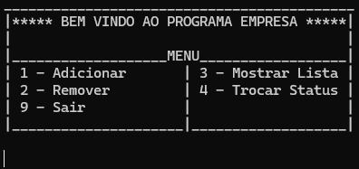
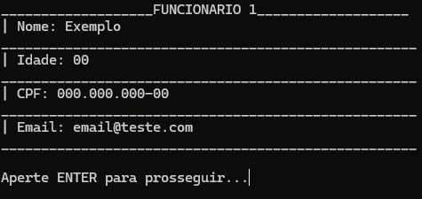

# EMPRESA - Sistema de Gestão em C

Bem-vindo ao projeto EMPRESA! Este é um programa desenvolvido em C para o estudo e prática de Estruturas de Dados. O sistema é projetado para gerenciar informações básicas de uma empresa, com funcionalidades de adicionar, remover, listar funcionários e modificar informações dos mesmos.

## Funcionalidades

  

- **Adicionar**: Adicione novos funcionários com informações básicas.
- **Remover**: Exclua funcionários do sistema.
- **Mostrar Lista**: Veja a lista completa de funcionários.
- **Trocar Status**: Altere dados dos funcionários.
- **Sair**: Encerra o programa e gera um arquivo "Lista_Funcionarios.csv".

## Adicionando Funcionário

  

### Requisitos

- Compilador C (por exemplo, DEV C++)
- Sistema operacional: Windows, Linux, ou macOS
